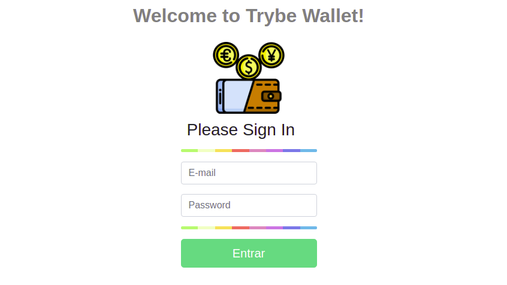

# Project Trybe Wallet
#### Este projeto faz parte da formação Full Stack da <a href="https://www.betrybe.com/">Trybe</a>.

## Introdução
Esta aplicação é uma carteira de controle de gastos com conversor de moedas, onde o usuário terá as opções de:
  - Adicionar e remover um gasto;
  - Visualizar uma tabelas com seus gastos;
  - Visualizar o total de gastos convertidos para uma moeda de escolha;


# Habilidades
Neste projeto, o objetivo era consolidar o conhecimento adquirido, genrenciando o estado da aplicação com Redux e conectando-o aos componentes React. a partir da criação de um store, reducers, actions e dispatchers.

## Desenvolvimento

### Tela Login


### Tela Wallet


Para iniciar o desenvolvimento, é necessário clonar o repositório do GitHub, acessar o projeto Wallet e intalar as dependências:
```shell
cd "diretorio de sua preferencia"

git clone git@github.com:legalvao1/sd-010-b-project-trybewallet.git

cd Project-TrybeWallet

npm install
